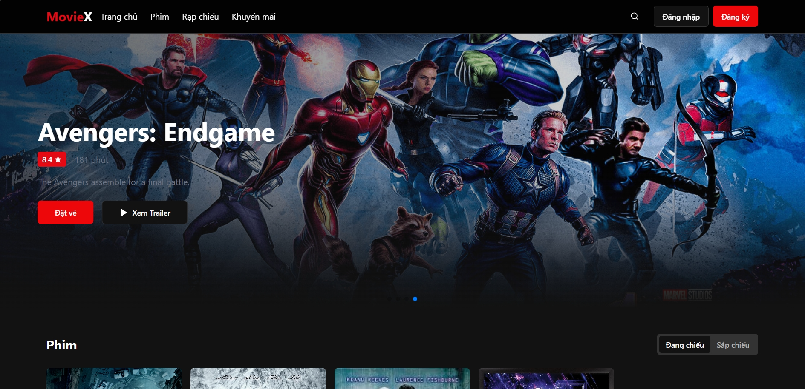

# MovieX - Client

**MovieX** là phần frontend của hệ thống đặt vé xem phim trực tuyến, được xây dựng bằng **ReactJS** kết hợp với **Vite** để tối ưu hiệu năng phát triển và tốc độ tải trang.

## Mục tiêu dự án

Tạo ra một nền tảng trực quan, mượt mà và phản hồi nhanh cho người dùng khi:

* Duyệt phim và lịch chiếu
* Chọn ghế theo sơ đồ rạp
* Giữ ghế realtime
* Thanh toán và xác nhận vé

## Công nghệ và thư viện sử dụng

* **UI/UX hiện đại** với [ShadCN UI](https://ui.shadcn.dev/), kết hợp các thành phần từ `@radix-ui`, `tailwindcss`, `lucide-react`, `vaul`, `cmdk`,...
* **Quản lý form & validate** với `react-hook-form`, `zod`, `@hookform/resolvers`
* **Giao tiếp API** với `axios`, `@tanstack/react-query` để tối ưu cache và xử lý bất đồng bộ
* **Quản lý trạng thái** với `@reduxjs/toolkit` và `react-redux`
* **Routing** với `react-router-dom`
* **Hiển thị biểu đồ & phân tích** với `recharts`
* **Swiper** để tạo hiệu ứng trình chiếu mượt mà cho banner và phim
* **Xử lý thời gian** với `date-fns`
* **Tương thích responsive** với thiết kế mobile-first bằng Tailwind CSS

## Tính năng nổi bật

* **Realtime seat locking**: Giữ ghế theo thời gian thực để tránh người khác đặt trùng
* **Hệ thống xác thực bảo mật**: Sử dụng `jwt-decode` để kiểm soát phiên người dùng
* **Đa giao diện & chủ đề sáng/tối** với `next-themes`
* **OTP & xác minh người dùng**: Thư viện `input-otp` được tích hợp cho trải nghiệm bảo mật nâng cao
* **Tối ưu hóa developer experience**: ESLint, TypeScript, cấu hình Tailwind và chuẩn hóa code theo cấu trúc linh hoạt

## Hướng dẫn chạy dự án

### Yêu cầu hệ thống

Trước khi bắt đầu, hãy đảm bảo rằng bạn đã cài đặt:

- Node.js >= 22.x
- npm >= 10.x

### Cài đặt dự án

```sh
# Clone source về máy
git clone https://github.com/limbanga/moviex-client.git

# Di chuyển vào thư mục dự án
cd moviex-client

# Cài đặt các dependencies
npm install
# hoặc nếu bạn dùng yarn
yarn install

# cấu hình file .env
cp .env.example .env # sửa lại cho phù hợp với server
```
*mình sẽ cập nhật server sau hihi :)*
### Môi trường phát triển

```bash
# Khởi chạy ứng dụng ở chế độ development
npm run dev
# hoặc
yarn dev
```

Ứng dụng sẽ chạy tại địa chỉ mặc định:
http://localhost:8080

## Shortscreen

### Phần trang chủ

